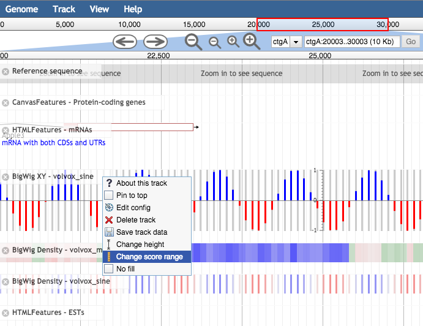
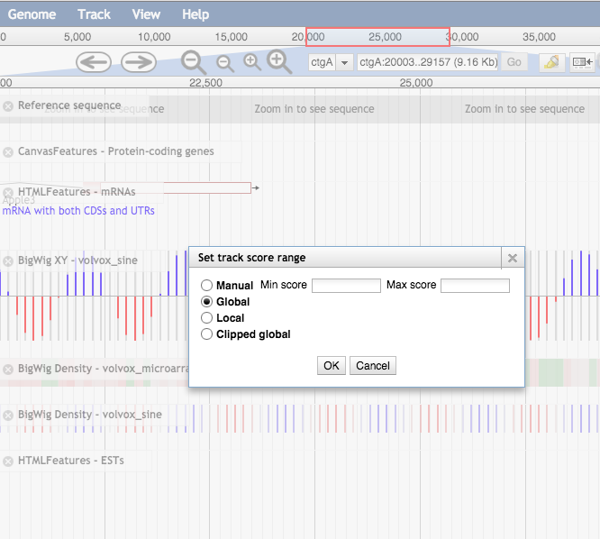

# Track Score Plugin
This is a JBrowse plugin
 
this plugin is to be used to add a menu option for XYPlot and MethylXYPlot tracks that allows the user to change the y-axis limits without needing to edit the config file

## Install

For JBrowse 1.11.6+ in the _JBrowse/plugins_ folder, type:  
``git clone https://github.com/bhofmei/jbplugin-trackscores.git TrackScorePlugin``

## Activate
Add this to _jbrowse.conf_ under `[GENERAL]`:

    [ plugins.TrackScorePlugin ]
    location = plugins/TrackScorePlugin

If that doesn't work, add this to jbrowse_conf.json:

    "plugins" : {
        "TrackScorePlugin" : { "location" : "plugins/TrackScorePlugin" }
    }

## Usage

For all quantitative tracks, there will now be an additional menu option "Change score range", which can be used to change the autoscale and/or min/max options without needing to manually edit the configuation.

This opens a dialog box where the user can select between the autoscale options "Global", "Local", and "Clipped global" or manually set the y-axis limits.

